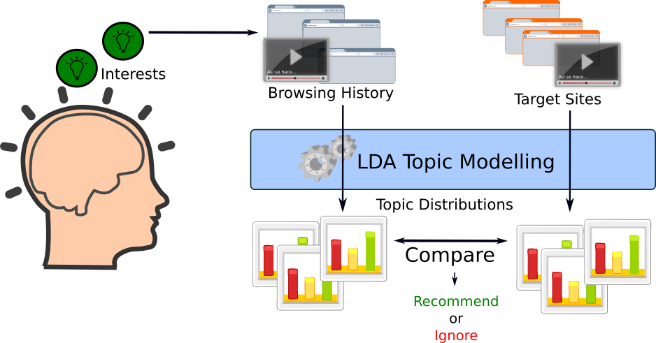
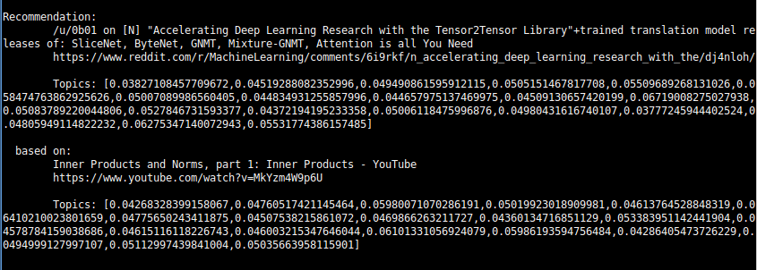
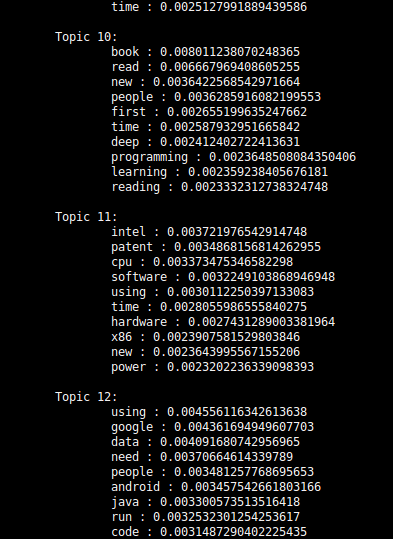

# Content Recommendations using Latent Dirichlet Allocation

## Overview

Content Recommender is a cross-website recommender system that recommends content from a list of target
websites based on user's browsing history. 




## System Design

The system is based on [Latent Dirichlet Allocation](https://en.wikipedia.org/wiki/Latent_Dirichlet_allocation) (or "LDA") 
unsupervised  topic modelling techniques.

There are many LDA implementations around: 

scikit-learn provides one (http://scikit-learn.org/stable/modules/decomposition.html#latentdirichletallocation).

Apache Spark's MLlib provides two (spark.apache.org/docs/latest/mllib-clustering.html#latent-dirichlet-allocation-lda).

This particular system uses Spark's MLlib, and can be run on a single machine or on a cluster of machines.


## System Requirements

+ For small volumes of browsing history and target URLs, a system with 2 cores, 8GB RAM and 20GB free storage is sufficient 
  (most of the storage used is of a temporary nature while Spark does its processing and is deleted after it's done). You 
  can run the whole application in a local machine if it satisfies those requirements.
+ For larger volumes, a server or cluster of servers with 4 cores, atleast 32GB RAM and atleast 60GB free storage is recommended. 
+ The system fetches content from history and target URLs. This may incur additional data transfer costs if deployed in some clouds.
+ The software targets only the Ubuntu 16.04 LTS distribution. It may also work with Ubuntu 14.04 LTS. It's unlikely to run on other distributions.

In the rest of the document, I'll use a Linode 60GB high memory instance (4 cores, 60GB RAM, 90GB storage) with Ubuntu 16.04 LTS
as the selected configuration.

## Installation

Install this [Chrome History Export extension](https://chrome.google.com/webstore/detail/history-export/lpmoaclacdaofhlijejogfldmgkdlglj) in Google Chrome browser on your personal computer. This enables you to export browsing history to a JSON file.

 

In local mode, the entire system runs off a single machine - either your personal machine or a server.
This is the most common use case and is suitable when volume of browsing and target content is low.

1. Create and secure a Linode that matches or exceeds the [System Requirements](#system-requirements).
   Follow the [Getting Started](https://www.linode.com/docs/getting-started) and [Securing your Server](https://www.linode.com/docs/security/securing-your-server) guides.
   Deploy the Ubuntu 16.04 LTS image.

2. *Important:* Ensure that the Linode is configured with a [private IP address](https://www.linode.com/docs/networking/remote-access#adding-private-ip-addresses)

3. Log in to the server via SSH as root.

4. Download the deployment script code:
   ```bash
   apt install wget
   cd ~
   wget https://raw.githubusercontent.com/pathbreak/content-recommender-spark-lda/master/deploy/master.sh
   ```

5. Initialize the server for running rest of the script:

   ```bash
   chmod +x master.sh
   ./master.sh init
   ```

6. Install the software:

   ```bash
   ./master.sh install-master
   ```

   This installs the recommender app under `/root/spark/recommender`and Apache Spark under `/root/spark/stockspark`. 

   ​

7. Configure the list of target URLs you want the system to recommend content from. 
   Open `/root/spark/recommender/app/conf/conf.yml` and edit the `TARGETS`list as per your interests. 
   As of now, it supports RSS/ATOM feed URLs and YouTube API.

   ```yaml
   # A TARGET is a website or web resource whose contents should be analyzed
   # by the system for finding recommendations that are similar to your interests
   # based on analysis of your browsing history.
   # Every target has a 
   #   - name: a friendly name for the target.
   #   - type: a type that decides which target handler plugin handles the target.
   #           This should match the 'self.type' attribute of one of the target handlers.
   #   - <other handler specific attributes documented in respective handler's source code>
   TARGETS:
   - name: tech-reddit
     url: https://www.reddit.com/r/technology+hardware+programming+electronics+gadgets/.rss?limit=200
     type: feed

   - name: tech-reddit-comments
     url: https://www.reddit.com/r/technology+hardware+programming+electronics+gadgets/comments.rss?limit=200
     type: feed

   - name: ml-datascience-reddit
     url: https://www.reddit.com/r/MachineLearning+datascience/.rss?limit=200
     type: feed
       
   - name: ml-datascience-reddit-comments
     url: https://www.reddit.com/r/MachineLearning+datascience/comments.rss?limit=200
     type: feed
       
     # period: (Optional) Makes youtube API search only in last 6 hours. This should be 
     #         synchronized with the cron job period if you don't want to miss anything.
     #         If not specified, default is last 6 hours.
     # query: (Optional) Makes youtube API search only matching videos. Kind of pointless
     #         when the whole point of topic modelling is to find content with
     #         hidden relationships, but use it if you know what you're doing.
   - name: youtube-latest
     type: youtube
     period: 6

   ```
   
8. If you are interested in examination of and recommendations from YouTube videos, you need to obtain
   a YouTube API key first. 
   See [https://developers.google.com/youtube/v3/getting-started#before-you-start](https://developers.google.com/youtube/v3/getting-started#before-you-start)on how to get an API key.
   Then make a copy of `/root/spark/recommender/app/conf/yt_api_key_template.yml` as `/root/spark/recommender/app/conf/yt_api_key.yml`, 
   open it in an editor, and 
   insert your YouTube API key there between the double quotes. 
   
   ```bash
   cp /root/spark/recommender/app/conf/yt_api_key_template.yml /root/spark/recommender/app/conf/yt_api_key.yml
   nano /root/spark/recommender/app/conf/yt_api_key.yml
   # Insert your YouTube API key key between the double quotes after "key":""
   ```


See [Usage](#usage) for instructions on how use the software for recommendations.

## Usage

1. Click on the Chrome Export History extension's button to download a browsing history JSON file.

2. Upload the history file to your server using SFTP or a tool like FileZilla.

3. Instruct the recommender to examine the history file and fetch contents of recognized URLs. 
   As of now, it supports examination of only HackerNews and YouTube URLs, and ignores all other URLs:

   ```bash
   cd /root/spark/recommender/app
   python3 recommender_app.py upload [PATH-OF-UPLOADED-JSON-FILE]
   ```

   This fetches contents from URLs in browsing history  and stores them under `/root/spark/data/historydata/YYYY-MM-DD`.

4. Instruct the recommender to fetch content from target URLs:

   ```bash
   cd /root/spark/recommender/app
   python3 recommender_app.py upload
   ```

   You can also configure this to run periodically in crontab:

   ```bash
   crontab -e
   0 */6 * * * python3 /root/spark/recommender/app/recommender_app.py fetch
   ```

5.  Get recommendations:

   ```bash
   cd /root/spark/recommender/app
   python3 recommender_app.py recommend [HISTORY-DIRECTORY] [TARGET-DIRECTORY] [NUMBER-OF-TOPICS] [NUMBER-OF-ITERATIONS]

   # Example:
   python3 recommender_app.py recommend \
   	/root/spark/data/historydata/2017-06-28 \
   	/root/spark/data/targetdata/2017-06-28 \
   	20 \
   	50
   ```

   NUMBER-OF-TOPICS depends on your interests and your perception of how relevant the recommendations shown are. Start with a small number like 10 and then increase it in steps of 10 until the recommendations seem useful.
   ​
   NUMBER-OF-ITERATIONS should not be too low.  50-100 is an ideal range.
   ​
   Output Screenshots:

   

6. 


## Known problems

+ Does not handle content in non-English languages, but does not detect and discard other languages either. 
  Recommendations may include content from non-English languages. If so, they should be ignored.

+ The recommended content and the content on which it's supposedly based often don't match as perceived by 
  humans.

+ Some target URL content may show zero weights for all topics. The system should ideally discard these, but doesn't
  do so as of now. 
